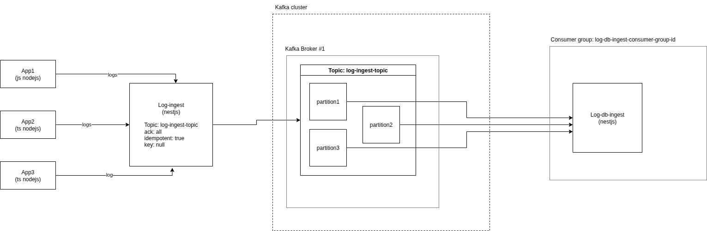

# 🐼 Log Panda – Event Driven Logging System  

🐼 Real-time log pipeline to explore **event-driven architecture** with **Kafka**, **Debezium**, **NestJS**, **Postgres**, **MySQL** and **Elasticsearch** — built to learn modern data streaming, observability, and scaling with Docker &amp; Kubernetes.

The system ingests logs from multiple apps, publishes them to Kafka, and processes them via consumers for storage and analysis.  

---

## 🚀 Project Flow  




1. **Apps (App1 / App2 / App3)**  
   - Dummy services that generate logs and send them via HTTP POST to the **Log Ingest** service.  

2. **Log Ingest (NestJS)**  
   - Acts as a gateway to receive logs.  
   - Validates payloads (DTOs with class-validator).  
   - Publishes messages to Kafka (`log-ingest-topic`).  

3. **Kafka (Broker + Init Service)**  
   - Runs in **KRaft mode** (no ZooKeeper).  
   - Topics are auto-created on container start (via init script).  
   - Provides durability and scaling with partitions.  

4. **Log DB Ingest (NestJS)**  
   - Kafka consumer service.  
   - Reads logs from Kafka in batches (configurable).  
   - Inserts processed logs into **Postgres**.  

---

## 🏗️ Monorepo Structure  

```
log-panda/
│── apps/
│   ├── app1/                 # Dummy log producer app
│   ├── app2/
│   ├── app3/
│   ├── log-ingest/           # NestJS service (producer)
│   └── log-db-ingest/        # NestJS service (consumer + Postgres)
│
│── docker/
│   ├── kafka.Dockerfile      # Kafka image
│   └── scripts/
│       └── create-topics.sh  # Auto-create Kafka topics
│
│── docker-compose.yml        # Ingest + Kafka + DB consumer
│── docker-compose-test-apps.yml  # Dummy apps (App1/App2/App3)
│── README.md                 # You're reading it 🙂
```

---

## ⚡ Getting Started  

### 1. Clone the repo  
```bash
git clone https://github.com/your-org/log-panda.git
cd log-panda
```

### 2. Start postgres  
```bash
docker compose -f docker-compose-pg.yml up --build
```

This brings log-db-postgres which stores the logs data.


### 3. Start Kafka + Ingest + DB Consumer  
```bash
docker compose up --build
```

This brings up:  
- `log-ingest` → NestJS service for ingesting logs.  
- `log-ingest-kafka` → Kafka broker (KRaft).  
- `log-ingest-kafka-init` → Init container to create topics.  
- `log-db-ingest` → NestJS consumer service (logs → Postgres).  


### 4. Start Dummy Apps  
```bash
docker compose -f docker-compose-test-apps.yml up --build
```

This brings up App1, App2, App3, each generating logs and sending them to `log-ingest`.

---

## 🛠️ Useful Commands  

### Check Kafka topics
```bash
docker exec -it log_panda_log_ingest_kafka_c kafka-topics.sh   --bootstrap-server localhost:9092 --list
```

### Produce a message manually
```bash
docker exec -it log_panda_log_ingest_kafka_c kafka-console-producer.sh   --broker-list localhost:9092 --topic log-ingest-topic
```

### Consume messages manually
```bash
docker exec -it log_panda_log_ingest_kafka_c kafka-console-consumer.sh   --bootstrap-server localhost:9092 --topic log-ingest-topic --from-beginning
```

---

## 📦 Data Flow Recap  

1. **App1/App2/App3 → Log Ingest**  
   - `POST /ingest` → JSON log payload  

2. **Log Ingest → Kafka**  
   - Publishes messages with **idempotent producer** enabled  

3. **Kafka → Log DB Ingest**  
   - Consumer group ensures parallelism across partitions  
   - Logs are batched and stored in Postgres  

---

## 🔮 Next Steps  

- Add **Kafka Connect** for syncing logs to **Elasticsearch (EKS)**.  
- Add **Prometheus + Grafana** for observability.  
- Scale with **Kubernetes** for multiple consumers.  
- Implement **idempotency at DB layer** for strong guarantees.  

---

✨ With this setup, you already have a **real-world style event-driven pipeline** running locally.  